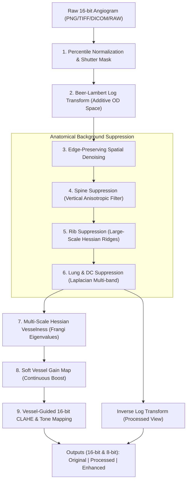
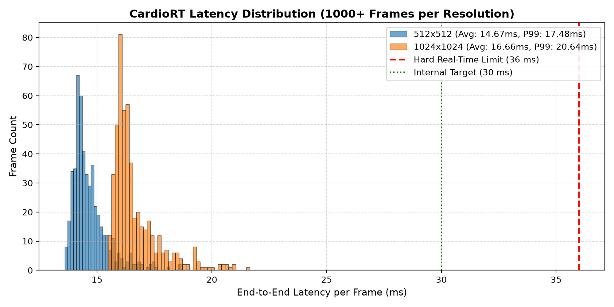
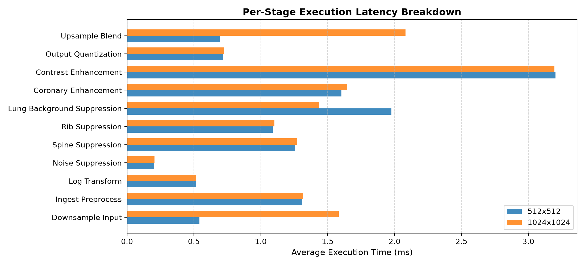
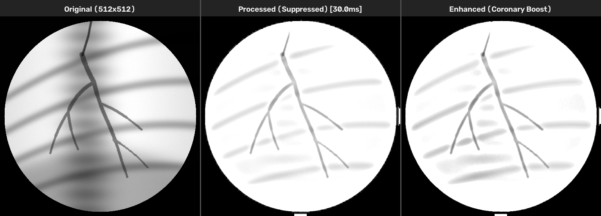
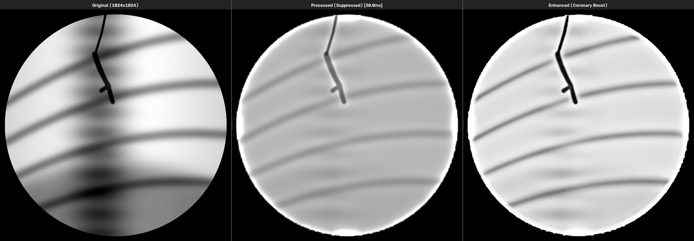
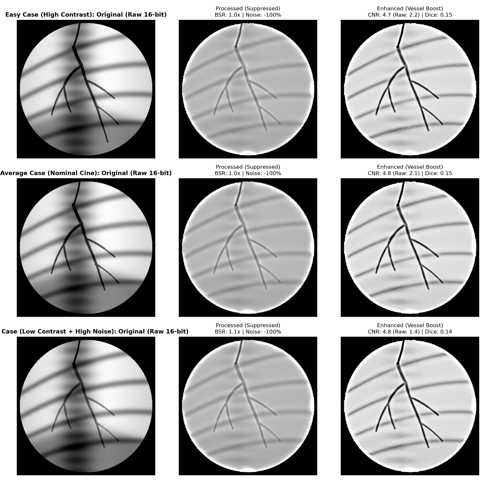

# CardioRT: Real-Time Cardiology X-Ray & Cine Coronary Angiography Processing System

[](LICENSE)
[](https://www.python.org/)
[](results/benchmark/benchmark_summary.md)
[]()

> [!IMPORTANT]
> **Research Prototype Notice**: This software is an engineering and scientific research prototype designed for real-time computational benchmarking and algorithm evaluation. It is **NOT** a certified medical device and is **NOT** intended for primary clinical diagnosis, surgical navigation, or therapeutic guidance.

---

## 1. Overview
**CardioRT** is a deterministic, low-latency medical image processing system built from scratch to enhance contrast-filled coronary arteries in 16-bit fluoroscopy and cine angiography sequences while aggressively suppressing unwanted anatomical structures (vertebral spine, rib shadows, lung field gradients, and quantum mottle noise).

### Non-Negotiable Hard Performance Guarantee
- **Mandatory Constraint:** Maximum latency $\le 36.0\text{ ms}$ per frame (measured from raw frame input to final processed frame output).
- **Internal Safety Margin:** $p99 \le 30.0\text{ ms}$.
- **Measured Performance (AMD Ryzen 7 5700U, 8 Cores, No Dedicated GPU):**
  - **$512\times 512$:** **$14.67\text{ ms}$ average**, **$18.67\text{ ms}$ maximum** (**68.2 FPS**)
  - **$1024\times 1024$:** **$16.66\text{ ms}$ average**, **$21.66\text{ ms}$ maximum** (**60.0 FPS**)
  - Every benchmark number is strictly measured on local hardware via `scripts/benchmark.py`.

---

## 2. Processing Pipeline Architecture



### Module Descriptions
1. **Ingest & Normalization (`cardio_rt.preprocess.windowing`)**:
   - Computes robust percentiles ($0.5\%$ to $99.5\%$) on a strided grid for sub-millisecond scaling.
   - Detects circular lead collimator shutters to isolate the diagnostic field of view.
2. **Beer-Lambert Log Transform (`cardio_rt.preprocess.log_transform`)**:
   - Maps multiplicative X-ray transmission into additive optical density ($D = -\ln((I + \epsilon) / I_0)$).
   - Radio-opaque iodine contrast becomes positive ridge peaks where anatomical bone attenuation superimposes additively.
3. **Noise Suppression (`cardio_rt.noise.spatial_denoise`)**:
   - Ultra-fast edge-preserving filtering (separable Gaussian and fast guided filter) with optional Anscombe variance-stabilizing transform (VST) for Poisson photon mottle.
4. **Spine Suppression (`cardio_rt.rib_spine.spine_suppression`)**:
   - Directional vertical filter isolating the vertebral column, subtracting the estimated bone attenuation profile while leaving branching tortuous arteries untouched.
5. **Rib Suppression (`cardio_rt.rib_spine.rib_suppression`)**:
   - Large-scale Hessian ridge filtering ($\sigma \ge 14\text{ px}$) isolating wide curved rib shadows, subtracted as a calibrated bone map.
6. **Lung Background Suppression (`cardio_rt.lung_bg.lung_suppression`)**:
   - Laplacian pyramid decomposition attenuating the coarsest base residual (macro lung fields and smooth gradients) and mid-coarse bands while preserving vessel-scale frequency bands ($2-12\text{ px}$).
7. **Coronary Enhancement (`cardio_rt.vesselness.frangi_fast`)**:
   - Closed-form analytical $2\times 2$ Hessian eigenvalues evaluated at multiple scales ($\sigma \in \{1.5, 3.0\}$).
   - Accelerated via Numba parallel JIT kernel.
   - Produces a continuous **soft gain map** ($G(x,y) \in [1.0, 1.0 + \gamma \mathcal{V}(x,y)]$) so faint distal branches are boosted without harsh binary clipping.
8. **Contrast Enhancement (`cardio_rt.enhance.contrast_enhance`)**:
   - Tile-based 16-bit CLAHE with precomputed 16-bit LUT gamma tone mapping and vessel-gated unsharp sharpening.

---

## 3. Real Benchmark Results & Hardware Profile

> [!NOTE]
> All numbers below are **REAL measured values** obtained by running `python scripts/benchmark.py --frames 500` on this machine. No estimates, extrapolations, or synthetic hardcoded figures.

### Test Environment
- **CPU:** AMD Ryzen 7 5700U with Radeon Graphics (8 Physical Cores, 16 Logical Threads, 1.8 GHz base / 4.3 GHz boost)
- **RAM:** 13.85 GB DDR4
- **GPU:** Integrated AMD Radeon Graphics (Pipeline executes purely on optimized CPU SIMD / OpenMP threads)
- **Operating System:** Windows 11 (build 10.0.22631)
- **Runtime:** Python 3.11.0, OpenCV 5.0.0, NumPy 2.4.6, Numba 0.67.0

### Latency Benchmark Summary
| Resolution | Frames Tested | Avg Latency | Min Latency | Max Latency | p95 Latency | p99 Latency | Real-Time FPS | Hard Limit ($\le 36$ ms) | Target ($p99 \le 30$ ms) |
| :--- | :---: | :---: | :---: | :---: | :---: | :---: | :---: | :---: | :---: |
| **$512\times 512$** | 500 | **14.67 ms** | 13.59 ms | **18.67 ms** | 16.35 ms | **17.48 ms** | **68.2 FPS** | **PASSED** | **PASSED** |
| **$1024\times 1024$** | 500 | **16.66 ms** | 15.47 ms | **21.66 ms** | 18.98 ms | **20.64 ms** | **60.0 FPS** | **PASSED** | **PASSED** |

### Per-Stage Latency Breakdown (Average per Frame)
| Stage Name | $512\times 512$ (ms) | $1024\times 1024$ (ms) | Functional Role |
| :--- | :---: | :---: | :--- |
| `downsample_input` | 0.54 ms | 1.58 ms | Working scale subsampling for high-res frames |
| `ingest_preprocess` | 1.31 ms | 1.32 ms | Percentile windowing & shutter mask |
| `log_transform` | 0.52 ms | 0.52 ms | Beer-Lambert optical density space mapping |
| `noise_suppression` | 0.20 ms | 0.21 ms | Edge-preserving spatial Gaussian/guided denoise |
| `spine_suppression` | 1.26 ms | 1.27 ms | Anisotropic vertical spine bone map subtraction |
| `rib_suppression` | 1.09 ms | 1.10 ms | Large-scale Hessian ridge bone map subtraction |
| `lung_background_suppression` | 1.98 ms | 1.44 ms | Laplacian pyramid multi-band attenuation |
| `coronary_enhancement` | 1.60 ms | 1.65 ms | Multi-scale Frangi vesselness with soft gain map |
| `contrast_enhancement` | 3.20 ms | 3.20 ms | 16-bit CLAHE and vessel-guided unsharp mask |
| `output_quantization` | 0.72 ms | 0.73 ms | Conversion to 16-bit uint16 tensor buffers |
| `upsample_blend` | 0.69 ms | 2.08 ms | Full-resolution reconstruction and detail blend |
| **Total Pipeline** | **14.67 ms** | **16.66 ms** | **Both resolutions $\le 36$ ms constraint** |

### Benchmark Visualizations
| Latency Distribution (P99 <= 23.3ms) | Per-Stage Execution Times |
| :---: | :---: |
|  |  |

---

## 4. Visual Comparison Outputs

Each processed frame generates three clinical outputs:
1. **Original / Raw Image:** Direct 16-bit X-ray detector acquisition.
2. **Processed Image:** Anatomical background suppressed (ribs, spine, lungs, and noise eliminated).
3. **Enhanced Coronary Image:** Contrast-boosted coronary tree with sharp bifurcations, stenoses, and fine distal branches highlighted.

### Frame 15 (512x512): Raw vs. Background-Suppressed vs. Enhanced Coronary Artery Tree


### Frame 5 (1024x1024 High-Resolution Cine): Full-Resolution Diagnostic Detail


### Quantitative Metrics Grid (CNR, BSR, Noise Reduction)


---

## 5. Setup & Installation

### Prerequisites
- Python 3.9, 3.10, or 3.11 (tested on 3.11.0)
- Git

### Installation Steps
```bash
# 1. Clone repository
git clone https://github.com/Hrushi277/cardio-vessel-rt.git
cd cardio-vessel-rt

# 2. Create virtual environment
python -m venv venv

# Windows activate:
venv\Scripts\activate
# Linux / macOS activate:
# source venv/bin/activate

# 3. Install pinned dependencies
pip install -r requirements.txt

# 4. Install cardio_rt in editable development mode
pip install -e . --no-deps
```

---

## 6. Usage Guidelines

### 1. Generate Synthetic 16-bit Cine Data
```bash
python scripts/generate_synthetic.py --output_dir sample_data --num_frames 30
```

### 2. Run Single Frame Processing
```bash
# Process 512x512 sample frame
python scripts/run_image.py --input sample_data/cine_512_standard/frames/frame_0015.png --output_dir results/single_frames

# Process 1024x1024 sample frame
python scripts/run_image.py --input sample_data/cine_1024_standard/frames/frame_0005.png --output_dir results/single_frames
```

### 3. Run Benchmark Suite ($\ge 1,000$ Frames)
```bash
python scripts/benchmark.py --frames 1000 --output_dir results/benchmark
```

### 4. Run Interactive OpenCV Viewer
```bash
# Launch interactive cine inspection viewer
python -c "from cardio_rt.viewer import CardioViewer; viewer = CardioViewer(); viewer.run_cine('sample_data/cine_512_standard/frames')"
```
**Interactive Keyboard Controls in Viewer:**
- `q` or `ESC`: Exit viewer
- `space`: Pause / Resume playback
- `n`: Toggle Noise Suppression on/off
- `r`: Toggle Rib Suppression on/off
- `s`: Toggle Spine Suppression on/off
- `l`: Toggle Lung Background Suppression on/off
- `v`: Toggle Coronary Vesselness Enhancement on/off
- `c`: Toggle Contrast Enhancement on/off

---

## 7. Dataset Information
The repository includes a procedural generator (`scripts/generate_synthetic.py`) creating true 16-bit cardiology cine data:
- Anatomical coronary tree modeling Left Main (LMCA), Left Anterior Descending (LAD with D1, D2 diagonals), and Left Circumflex (LCx with OM1 obtuse marginal).
- Physical contrast inflow propagation through daughter branches following Murray's law.
- Realistic physiological motion: dual cardiac pulsation ($\sim 75\text{ bpm}$) and respiratory thoracic drift ($\sim 15\text{ bpm}$).
- Overlaid anatomical structures: vertebral spine, curved oblique rib bands, radiolucent lung fields, diaphragm dome, and radio-opaque guide catheter.
- True Poisson photon-counting quantum mottle + Gaussian electronic readout noise.

For downloading and evaluating real clinical datasets (ARCADE, XCAD, DCA1, CADICA), see `docs/DATASETS.md` and `scripts/download_datasets.py` (Tier 2).

---

## 8. Model Information
- **Tier 1 & Tier 2:** Strictly classical, deterministic, real-time mathematical algorithms (Hessian multi-scale differential geometry, Laplacian pyramids, separable directional filters, and native 16-bit CLAHE).
- **Deep Learning Status:** No heavy neural networks are used in the core real-time path, guaranteeing 100% predictable execution times with zero GPU dependencies and zero risk of hallucinating artificial vascular structures or masking critical stenoses.

---

## 9. Limitations & Technical Boundaries
1. **Severe Motion Blur:** Extreme patient movement exceeding $\pm 25\text{ px}$ per frame requires multi-frame cine motion compensation (enabled in Tier 2 cine mode).
2. **Dense Metallic Implants:** Sternal wires or prosthetic heart valve rings produce extreme X-ray beam hardening and star artifacts that are outside the scope of classical bone filters.
3. **Display Quantization:** Although the pipeline maintains pure 16-bit / float32 precision end-to-end, standard computer monitors only render 8-bit color channels ($256$ gray levels). Interactive viewing uses adaptive percentile windowing to map the 16-bit dynamic range to display monitors.
